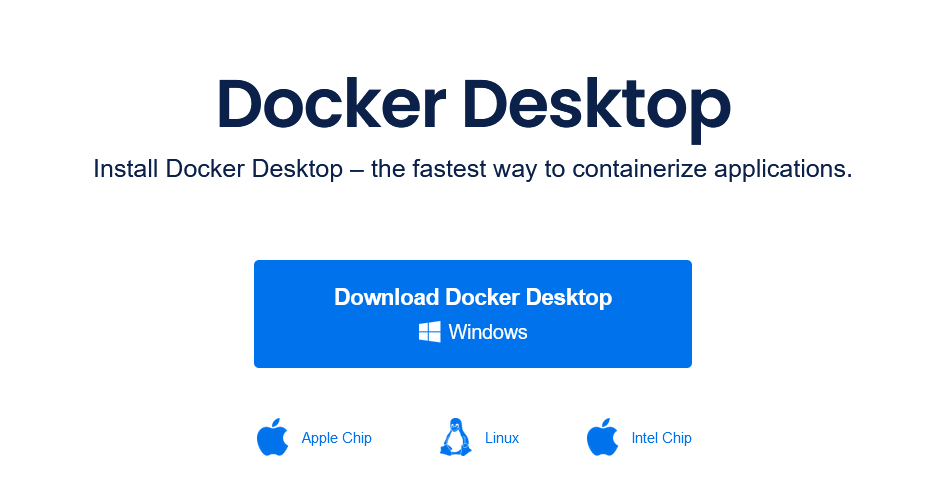
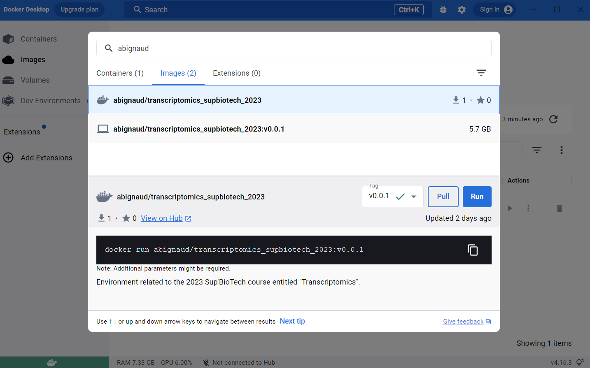
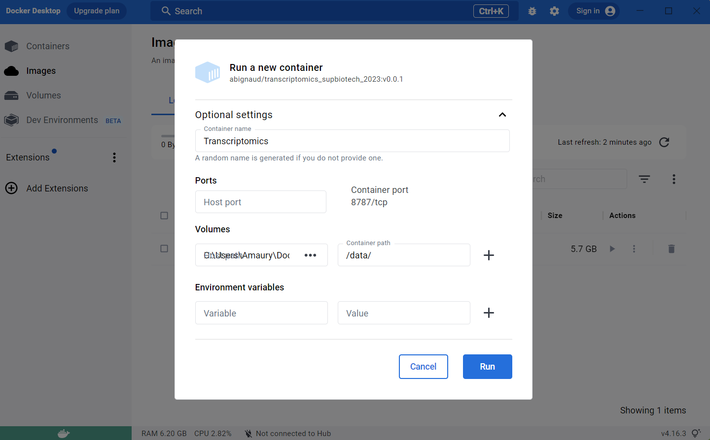

---
# Config

## Install docker-desktop

Downloads the executable
https://www.docker.com/products/docker-desktop/

### To install it on Mac:
https://docs.docker.com/desktop/install/mac-install/

### To install it on Windows:
https://docs.docker.com/desktop/install/windows-install/

### To install it on Linux/
https://docs.docker.com/desktop/install/linux-install/

## Install the docker image

A `docker` image is an image of a computer with some software installed on it. 
Basically, by pulling and running the image you will locally install that 
computer on your computer and all of you will work exactly on the same machine.

To install go the search bar at the top and search for 
`abignaud/transcriptomics_supbiotech_2023`, search for an `image` and then pull
it. It will take a little time to download (few GB as there are the whole OS for
the computer).

## Run the docker image

Create a `directory` where you want to store the files for the analysis.
Download the archive file in that directory (the link is in the email you 
received). 

Then go the image stuff. You should have a new image.

Run it and use the advanced settings:
- Select a name for the container (Transcriptomics_SupBioTech_2023 for example)
- Select the `directory` you created earlier as a host path
- Choose `/data/` as container path.

## Open terminal

Now open the terminal (3rd panel). If you didn't managed to do that step, it's 
ok.

Open the archive file, by entering that command:

`tar -xvzf transcriptomics_supbiotech_2023.tar.gz`

Congratulations your environment is set up !
